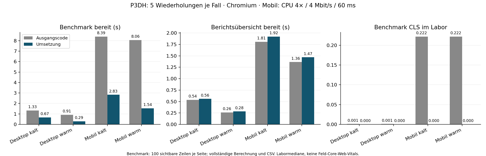

# Umsetzung der Performance- und UX-Issues #115–#119

Die Issues werden auf `perf/github-pages-review` nacheinander umgesetzt und je
Schritt separat geprüft. Ausgangscode: `902d0add0d117473791d129bc2d9180e9761e7f4`.
Die ursprüngliche Untersuchung vom 30.09.2026 bleibt in
[performance_review.md](performance_review.md) als historische Referenz erhalten.
Die hier folgenden Ergebnisse betreffen die Weiterentwicklung dieses Kandidaten.

## Messbedingungen und Grenzen

Die lokale Messung verwendet den unveränderlichen Datenstand
`f8adc69c5e8b623b289211cf4bb2f463916d23bf`. Desktop und gedrosseltes Chromium
(390 × 844, CPU 4×, 4 Mbit/s, 60 ms) sind Laborbedingungen. Ein physisches
Smartphone und ein echter Screenreader stehen in dieser Umgebung nicht zur
Verfügung. Tastatur-, Touch-Ereignisse und zugängliche Zustände werden im Browser
geprüft; sie ersetzen diese manuellen Abnahmen nicht. Es wird kein Feld-INP
behauptet. Die Änderungen werden als PR zur Prüfung bereitgestellt.

## #115 – CPU-Optimierungen

Formatter-Cache, Zeitreihenindex und Midrank-Berechnung werden gemeinsam
übernommen. Die unbewiesene Änderung von `no-store` auf `no-cache` wird nicht
übernommen. Die Label-Ladestrategie bleibt bis #116 auf dem Ausgangsverhalten.

Der Äquivalenztest vergleicht acht Profile samt CSV, 883 Berichtszuordnungen,
Zahlenformate beider Sprachen, 1.001 synthetische Perzentilfälle und die vollständigen
Template-HTML-Ausgaben dreier großer Berichte. CSV-Zeitstempel und lokale URL
werden normalisiert. Ergebnisse: `performance/results/issue115_verification.json`.

## #116 – Berichtsprefetch und Fehlerbehandlung

Die erste Berichtsdarstellung startet die Labels, bevor sie optionale Peer-Daten
anfordert. Die Benchmark-Ansicht fordert weiterhin keine Labels an. Alle
Lesestellen warten auf erfolgreiche Beschriftungen. Ein sichtbarer Retry-Knopf
ermöglicht einen neuen Abruf nach Fehlern; gleichzeitige Leser teilen den Request.
Späte Report- und Label-Antworten dürfen eine andere Ansicht nicht überschreiben.

`performance/test_ux.py` prüft Touch-Öffnung, Request-Zusammenfassung,
Abruffehler/Wiederholen und Navigation während eines verzögerten Report-Abrufs.
`performance/measure_labels.py` misst die erste Tabellenöffnung sofort nach der
Übersicht sowie nach 1,5 Sekunden Lesezeit, jeweils fünfmal auf Desktop/Mobil.
Diese Definition ist strenger als die frühere Öffnung nach Netzwerkberuhigung.

Die fünf Wiederholungen der strengeren Öffnungsmessung ergeben mobil:
Ausgangsstand sofort 4.752 ms / nach 1,5 s Lesen 3.294 ms; gewähltes Prefetch nach
Übersicht sofort 2.434 ms / nach Lesen 580 ms. Die frühere Review-Zahl 864 ms
stammt dagegen aus einer Öffnung nach Netzwerkberuhigung und ist nicht direkt
vergleichbar. Ein zusätzlich getesteter früher Abruf bringt sofort 2.219 ms,
verzögert die Übersicht aber von 1.822 auf 2.177 ms. Deshalb bleibt die Variante
nach der ersten Übersicht. Rohdaten: `issue116_baseline_expansion.json`,
`issue116_late_prefetch.json`, `issue116_early_prefetch.json`.
Das Ideal unter einer Sekunde unmittelbar nach der ersten Übersicht ist damit
noch nicht erreicht; nach kurzer Lesezeit liegt der Median darunter.

## #117 – Begrenzte Tabellenansicht mit vollständigem Datenbestand

Wiederverwendete Zeilen allein reichen nicht: Die Darstellung aller 814 Zeilen
bleibt mobil teuer. Deshalb zeigt der Benchmark 100 Zeilen je Seite. Sortierung,
Filter, Perzentile, Balkenbasis und CSV verwenden weiterhin sämtliche passenden
Datensätze. Die Oberfläche nennt den sichtbaren Bereich und erklärt, dass die
Browsersuche nur die aktuelle Seite durchsucht. Die Anwendungssuche umfasst alle
Berichte. Zeilen und Bedienelemente werden wiederverwendet, Fokus bleibt erhalten;
der DOM-Cache hält höchstens eine Seite.

Der Browser prüft gecachte gegen vollständig neu erzeugte Tabellen für alle acht
Profile, die vollständige Reihenfolge über alle Seiten, CSV über alle Treffer und
mehrmalige Sortierung ohne doppelte Eventhandler. Messung nach beruhigtem Laden,
je fünf Aktionen: mobil Sortieren Median 317 ms, Filtern 477 ms. Das sind
synthetische Aktionslatenzen, kein Feld-INP. Der erste reine DOM-Wiederverwendungs-
Versuch bleibt als `issue117_full_dom_actions.json` dokumentiert.

## #118 – Bedarfsgerechte Dateien und konsistenter Datenstand

Der Build erzeugt sieben nach Template aufgeteilte Benchmark-Dateien mit SHA-256
im Dateinamen. Ein Manifest im Codebook nennt die Abhängigkeiten jedes Profils.
Der Viewer lädt nur benötigte Templates, fasst gleichzeitige Abrufe zusammen und
prüft die Integrität. Fehlgeschlagene Abrufe sind wiederholbar. Bereits geladene
Profile benötigen beim Zurückwechseln keinen weiteren Abruf.

Die Veröffentlichung erzeugt zunächst einen Daten-Snapshot-Commit, anschließend
auf diesem Commit einen Versionszeiger. Der Viewer liest den Zeiger einmal und
verwendet dessen Commit für sämtliche weiteren Daten und beide Abrufquellen.
So können während einer Veröffentlichung keine Dateien unterschiedlicher
Datenstände kombiniert werden. Bei alten Publikationen ohne Zeiger bleibt der
Legacy-Modus verfügbar. Ungültige oder nicht abrufbare Zeiger führen zu einem
Fehler statt zu einer unbemerkten Mischung. Das bestehende Force-Push-Verfahren
archiviert frühere Publikationen weiterhin nicht dauerhaft.

Der echte Publisher wurde gegen ein temporäres lokales Git-Remote geprüft; es
wurde keine Veröffentlichung auf den produktiven `data`-Branch ausgeführt.
Sechs gezielte Python-Tests prüfen Manifest, Hashes, deterministische Ausgabe,
Bereinigung und die zwei Commits. Browser-Tests prüfen Profilwechsel, verspätete
Antworten, Retry und den Integritätsfehler mit Fallback auf denselben Commit.
Alle acht Profile und CSVs bleiben äquivalent zum Ausgangsstand.

Die Aufteilung rekonstruiert den vollständigen Benchmark verlustfrei. Für KM1
sinkt dessen gzip-Payload von 1.388.301 auf 593.325 Bytes (57,3 %). Die lokale
Messung mit fünf Wiederholungen ergibt mobil ungefähr 2,9 s bis zur ersten
Benchmark-Seite. Die neue Ansicht enthält 100 Zeilen; der Ausgangsstand zeichnete
alle 814. Beide Änderungen tragen zur Beschleunigung bei.

Die numerischen Daten stammen weiterhin aus dem oben genannten Commit. Für die
neuen Messungen werden daraus Manifest und Template-Dateien lokal erzeugt;
das Codebook erhält zusätzliche Metadaten. Beide A/B-Varianten erhalten dieselben
Daten. Details und Quellhashes stehen in `issue118_comparison_sources.json`.

## #119 – Stabiler Aufbau, Rückmeldung und Kontext

Layout-Shift-Quellen wurden im Browser bis zwei Sekunden nach dem Nachladen
optionaler Inhalte beobachtet. Der mobile Kopfbereich und die zunächst leere
Berichtsliste bekommen von Beginn an ihren benötigten Platz. Berichte mit
mehreren Stichtagen reservieren Platz für die Zeitreihe; Kennzahlenkarten
reservieren die Höhe der später ergänzten Perzentilbänder.

Große Rohtabellen zeigen vor der Berechnung einen zugänglichen Ladehinweis und
`aria-busy`. Gleichzeitige Öffnungen desselben Blocks werden zusammengefasst.
Zeitreihenfehler bieten eine Wiederholung. Berichtssuche und Scrollposition
werden beim Wechsel zwischen Ansichten in einem auf zehn Einträge begrenzten
Speicher erhalten. Filter, Sortierung und vollständiger CSV-Export werden durch
die bestehenden Browser-Verträge geprüft; zusätzlich prüft #119 Rückkehr zur
Berichtssuche, Scrollposition und Tabellenöffnung mit der Tastatur.

Die reservierte Zeitreihenfläche kann bei wenigen vergleichbaren Kennzahlen
Leerraum lassen. Das ist eine bewusste Abwägung zugunsten stabiler Inhalte beim
Nachladen. Physische Mobilgeräte und Screenreader bleiben manuell zu prüfen.

## Abschließende Prüfung

Am 01.10.2026 bestehen 1.454 Python-Tests und 1.662.385 Subtests; ein vorhandener
Parquet-Schematest wird wegen des nicht gebauten Artefakts übersprungen.
`final_tests.log` enthält den vollständigen Lauf (98,85 s). Die Browser-
Regressionen bestehen (`final_runtime.log`), ebenso die Äquivalenzprüfung
(`final_verification.log`) und die UX-Verträge (`issue119_ux.json`).

Die Layout-Quellenmessung ergibt für Desktop/Mobil × Benchmark/Bericht jeweils
keinen beobachteten Shift (`layout_after.json`). Vorher waren es mobil 0,222 und
im Desktop-Bericht 0,117 als Summe der aufgezeichneten Shifts. Dies ist eine
Laborbeobachtung mit Nachladefenster, keine Aussage über alle Geräte oder Feld-CLS.
Die finale wiederholte A/B-Messung aggregiert CLS separat über Session-Fenster.

### Finaler A/B-Vergleich

80 Beobachtungen, fünf Wiederholungen je Kombination, keine Browserfehler.
Mediane bis zur ersten nutzbaren Ansicht, in Sekunden:

| Ansicht | Gerät / Besuch | Ausgangscode | Umsetzung |
|---|---|---:|---:|
| Benchmark | Desktop kalt | 1,335 | 0,666 |
| Benchmark | Desktop warm | 0,914 | 0,294 |
| Benchmark | Mobil kalt | 8,390 | 2,831 |
| Benchmark | Mobil warm | 8,063 | 1,542 |
| Bericht | Desktop kalt | 0,538 | 0,558 |
| Bericht | Desktop warm | 0,262 | 0,283 |
| Bericht | Mobil kalt | 1,808 | 1,921 |
| Bericht | Mobil warm | 1,364 | 1,468 |

Die mobile Benchmark-Ansicht ist damit kalt 66 % und warm 81 % schneller.
Der Bericht erscheint dagegen in dieser Messreihe etwas später: mobil rund
0,11 s. Für ihn liegt der Gewinn bei schnellerer Tabellenöffnung nach kurzer
Lesezeit und stabilerem Layout, nicht bei einer schnelleren ersten Übersicht.
Fünf Wiederholungen erlauben keine belastbare Aussage über Gerätepopulationen.

CLS ist für den Kandidaten in sämtlichen 40 Kalt-/Warm-Beobachtungen null; auch
das deskriptive p90 ist null. Der Ausgangsstand liegt mobil im Median bei 0,222
und im Desktop-Bericht bei 0,117. Das Beobachtungsfenster erfasst nachgeladene
Inhalte; zusätzlich wurden deren Quellen separat bis zwei Sekunden nach
Netzwerkberuhigung aufgezeichnet.

Benchmark-Übertragung einschließlich Viewer und Metadaten: mobil kalt
2.072 → 725 KiB, warm 2.000 → 69 KiB. Die warmen Einsparungen entstehen mit den
normal cachebaren, inhaltsadressierten Template-Dateien; die alten Datenabrufe
verwendeten `no-store`. Dies sind gzip-Laborbytes, keine Produktions-Brotliwerte.
Die finalen fünf Sortier-/Filteraktionen ergeben mobil 316 / 474 ms und am
Desktop 52 / 85 ms. Diese Aktionslatenzen sind kein Feld-INP.

Rohdaten: `implementation_comparison.json`, vollständige Median/p90/Min/Max-
Auswertung: `implementation_comparison_summary.json`, Quellhashes:
`implementation_comparison_sources.json`, Aktionen: `implementation_actions.json`.
`python performance/plot_implementation.py` erzeugt Auswertung und Grafik.

Die GitHub-CI des Umsetzungscommits besteht ebenfalls: `unittest` und `artifacts`.
Draft-PR: [#120](https://github.com/Tobias-Run/P3DH/pull/120).
Die Issues bleiben bis zur Abnahme offen. Das Ideal einer sofortigen Tabellenöffnung
unter einer Sekunde, ein eigener Nachweis für die 100-ms-Rückmeldung aller langen
Aktionen sowie physische Geräte-/Screenreader-Prüfung sind weiter offen.

### Korrektur nach Smartphone-Vorschau

Der Smartphone-Test meldete `data_version.json 404`. Die bisher veröffentlichte
Datenversion enthält noch keinen Versionszeiger. Die bisherige Prüfung verlangte
404 von beiden Abrufquellen; ein zusätzlicher CDN-/Netzwerkfehler konnte den
zulässigen Legacy-Fallback verhindern. Für den optionalen Zeiger wird jetzt
zuerst die maßgebliche Raw-GitHub-Datenquelle geprüft. Deren bestätigte 404 wählt
den Legacy-Modus. Ein ungültiger Zeiger oder Ausfall ohne bestätigte Abwesenheit
bleibt ein Fehler und startet keine Datenabrufe.

`performance/test_data_pointer.py` prüft bestätigte Abwesenheit trotz gestörtem
CDN, ungültige Versionsangaben und vollständigen Ausfall. Das betrifft den
Produktions-Abrufpfad; die oben dokumentierte lokale A/B-Messung wurde vor dieser
Korrektur durchgeführt. Die externe HTML-Vorschau verwendet weiterhin den
publizierten Legacy-Datenstand und eignet sich zur Bedienungsprüfung, nicht zur
vollständigen Abnahme der neuen Datenaufteilung.
