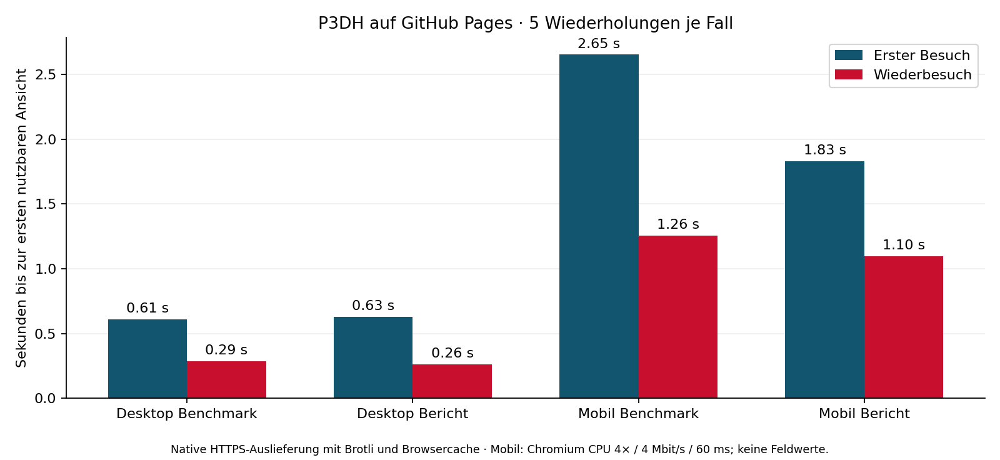

# Produktionsprüfung und Pages-Messung – 02.10.2026

PR [#120](https://github.com/Tobias-Run/P3DH/pull/120) ist gemergt.
Die [Pipeline 36933243825](https://github.com/Tobias-Run/P3DH/actions/runs/36933243825)
wurde mit `harvest=false`, `full_reparse=false`, `refresh_codebook=false` auf
`main` gestartet und erfolgreich beendet. Merge-Commit:
`b22b1b79c1dbe2397c47c5555cc5238a0af071f8`.

## Veröffentlichten Stand geprüft

- Pages liefert exakt den gemergten Viewer (Byte-/SHA-256-Vergleich).
- Datenbranch-Head: `38dd73e537d54c800f841d5826e494303a8c37b7`.
- Versionszeiger: Schema 1, Snapshot
  `f47ef2d32968e59188b4139ede3ccac1d9737f21`. Dieser Commit ist der Elterncommit
  des Zeiger-Commits und bleibt damit erreichbar.
- Alle sieben Template-Teile gegen ihre SHA-256 geprüft; CDN-KM1 stimmt mit dem
  Raw-Snapshot überein. Die Teile rekonstruieren den weiterhin enthaltenen
  Legacy-Benchmark verlustfrei. Der Bestand enthält 883 Berichte.
- Der native Browser lädt KM1 aus `benchmark/61.00.<sha256>.json`, ohne
  `benchmark.json`. Alle 40 Navigationen verwenden denselben Snapshot.

Nach Veröffentlichung konnte ein einfacher Abruf der zuvor fehlenden Raw-Datei
noch eine gecachte 404 zeigen. Der tatsächliche Browserabruf mit `cache:no-store`
lieferte den neuen Zeiger; dieser Pfad wurde vor und in sämtlichen Messungen geprüft.

## Methode

Gemessen wurde die echte [Pages-Seite](https://tobias-run.github.io/P3DH/processed/zweig_a/viewer_json.html),
nicht HTMLPreview und kein lokaler Server. Chromium verwendet native HTTPS-
Anfragen über den Umgebungsproxy, gültige TLS-Verifikation, Brotli und seinen
normalen HTTP-Cache. Es gab keine Request-Interception oder lokalen Antworten.
Die Proxy-CA wurde in Chromium/NSS importiert; TLS-Prüfung wurde nicht deaktiviert.

Fünf Wiederholungen je Desktop/Mobil × Benchmark/Bericht × Kalt-/Warmbesuch:
**40 finale Beobachtungen**. Desktop 1440×900 ohne künstliche Drosselung; Mobil
390×844, CPU 4×, zusätzlich 60 ms und 500.000 Bytes/s (4 Mbit/s). Das ist eine
Mobil-Laborsimulation, kein physisches Smartphone und keine Feldstatistik.

Jede Kombination erhält einen frischen Browserkontext. Der Wiederbesuch verlässt
das Dokument über `about:blank` und erhält den HTTP-Cache. LocalStorage wird nach
dem Erstbesuch geleert, damit geöffnete Themenblöcke die Wiederbesuchsansicht nicht
verändern. Ein Pilot mit erhaltenem UI-Zustand bleibt als
`pilot_stateful_measurements.json` erhalten und fließt nicht in die Endauswertung ein.
Er und die Vorprüfung können CDN-/Proxy-Caches aufwärmen. „Kalt“ bezeichnet daher
den Browsercache, nicht einen weltweit ungeprimten CDN-Knoten.

Bereit: relevante DOM-Ansicht vorhanden plus zwei Animationsframes. Für CLS
werden Netzwerkberuhigung und weitere zwei Sekunden optionaler Inhalte erfasst;
Aggregation über Session-Fenster. Aktionslatenzen enden nach zwei Frames und
werden zusätzlich auf Long Tasks und DOM-Größe untersucht. Es sind keine INP-
oder Lighthouse-TBT-Werte. Ein deskriptives p90 aus fünf Werten ist kein Feld-p75.

## Ergebnisse

Sekunden bis zur ersten nutzbaren Ansicht:

| Gerät | Ansicht | Besuch | Median | p90 | Min–Max | CLS maximal |
|---|---|---|---:|---:|---:|---:|
| Desktop | Benchmark | Erstbesuch | 0.609 | 0.747 | 0.585–0.783 | 0.0000 |
| Desktop | Benchmark | Wiederbesuch | 0.288 | 0.304 | 0.262–0.308 | 0.0000 |
| Desktop | Bericht | Erstbesuch | 0.628 | 0.684 | 0.598–0.709 | 0.0000 |
| Desktop | Bericht | Wiederbesuch | 0.261 | 0.270 | 0.234–0.274 | 0.0000 |
| Mobil simuliert | Benchmark | Erstbesuch | 2.653 | 2.768 | 2.619–2.801 | 0.0000 |
| Mobil simuliert | Benchmark | Wiederbesuch | 1.257 | 1.335 | 1.133–1.371 | 0.0000 |
| Mobil simuliert | Bericht | Erstbesuch | 1.829 | 1.949 | 1.743–2.009 | 0.0026 |
| Mobil simuliert | Bericht | Wiederbesuch | 1.097 | 1.188 | 0.949–1.198 | 0.0000 |



Die Live-Mediane liegen in der Größenordnung des kontrollierten neuen
Performance-Stands. Ein gleichzeitiger Produktions-A/B-Test gegen den alten
Viewer samt alter Datenveröffentlichung wurde nicht durchgeführt; die früheren
66/81-%-Angaben stammen aus dem dokumentierten lokalen A/B-Test und werden nicht
als auf Pages neu gemessene relative Verbesserung ausgegeben.

## Übertragung und Browsercache

CDP zeichnet tatsächliche HTTP-Antwortbytes auf, einschließlich Antwortheadern,
auch wenn Cross-Origin-Resource-Timing wegen fehlendem Timing-Allow-Origin keine
Transfergröße offenlegt. TCP/TLS- und Request-Overhead sind darin nicht enthalten.

- Benchmark Erstbesuch: etwa **658 KiB** insgesamt; Bericht etwa **1.329 KiB**.
- Wiederbesuch: etwa **0,24–0,25 KiB** Antwortbytes für den Versionszeiger.
  Viewer und Daten kommen aus dem Browsercache (vier gecachte Antworten für
  Benchmark, sieben für Bericht). Cached JSON wird weiterhin geparst und gerendert;
  warme Ladezeiten sind deshalb nicht null.
- KM1-Teil: `Content-Encoding: br`, etwa **528.739 Antwortbytes** im ersten
  beobachteten Abruf. Dateiantwort: `max-age=31536000`, `immutable`.
  Die früher dokumentierten **593.325 Bytes gzip** sind eine andere Kompression
  und nur die Benchmark-Datei, nicht die ganze Seite.

## Aktionen und Fehler

Fünf Aktionen je Geräteprofil nach beruhigtem Laden:

| Aktion | Desktop Median | Mobil Median |
|---|---:|---:|
| Sortieren bis sichtbarem Ergebnis | 72 ms | 317 ms |
| Filtern bis sichtbarem Ergebnis | 96 ms | 507 ms |
| Erste Tabellenöffnung nach beruhigtem Laden | 126 ms | 485 ms |
| Sortieren: Long-Task-Anteil über 50 ms | 8 ms | 213 ms |
| Filtern: Long-Task-Anteil über 50 ms | 25 ms | 401 ms |

Die direkte Tabellenöffnung unmittelbar nach der ersten Übersicht wurde mit
dieser Live-Reihe nicht geprüft. 485 ms gelten nach bereits geladenen Labels und
Netzwerkberuhigung. Mobil liegt Filtern knapp über dem Ziel von 500 ms; eine
sichtbare Rückmeldung innerhalb 100 ms für alle langen Aktionen bleibt unbewiesen.

Keine JavaScript-Fehler, keine fehlgeschlagenen Browserrequests und keine
Daten-/Viewer-HTTP-Fehler. Ein automatisch angefordertes
`https://tobias-run.github.io/favicon.ico` lieferte 404 im ersten Desktop-Sample;
der bestehende fehlende Browser-Tab-Icon-Pfad beeinflusst die Datenansicht nicht.
CLS-Median überall 0; größter Einzelwert **0,0026**, deutlich unter dem Laborziel 0,1.

## Nachverfolgung und Reproduktion

#115 kann als umgesetzt und geprüft geschlossen werden. #116–#119 erhalten
aktualisierte Abnahmechecklisten; nicht gemessene 100-ms-Ziele, unmittelbare
Tabellenöffnung, physische Geräte und Screenreader bleiben ausdrücklich offen.
Die Browser-Kommentare aus der Vorschau haben Versionszeiger, Sprache und interne
Navigation verbessert; sie ersetzen keine systematische physische Geräteabnahme.

Rollback: PR #120 revertieren; bei Bedarf den Datenbranch auf das gesicherte Tag
`rollback-pr120-data-2026-10-01` zurücksetzen. Die genaue Anleitung steht im PR.
Die Legacy-Datei ist weiterhin vorhanden, sodass ein Viewer-Revert nicht automatisch
einen Daten-Revert erfordert.

```bash
python performance/check_pages_publication.py
python performance/measure_pages.py --revision f47ef2d32968e59188b4139ede3ccac1d9737f21 --runs 5
python performance/summarize_pages.py
```

Diese Befehle lesen den dann aktuellen Produktionsstand; die Prüfung verlangt den
oben genannten Snapshot und identischen Viewer. Nach einem späteren Datenlauf
muss die erwartete Revision angepasst werden. Gegen zukünftige Veröffentlichungen
sind die gespeicherten Rohdaten die historische Referenz.

Artefakte: [production_2026-10-02](../performance/results/production_2026-10-02/):
`pipeline.json`, `publication.json`, `measurements.json`, `summary.json`, Grafik,
Screenshots und Pilot. `check_pages_publication.py`, `measure_pages.py` und
`summarize_pages.py` sind reine Prüf-/Messwerkzeuge und veröffentlichen keine Daten. Der separat ausgelöste GitHub-Workflow publiziert Daten.
