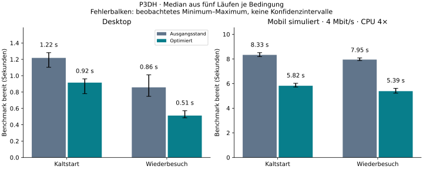

# Performance-Review: P3DH auf GitHub Pages

Stand: 30. September 2026. Untersucht wurden die veröffentlichte Auslieferung und
ein lokal reproduzierbarer Vergleich des bisherigen Viewers mit einem optimierten
Kandidaten. Die Änderungen liegen lokal auf `perf/github-pages-review`; sie sind
nicht auf GitHub Pages veröffentlicht.

## Ergebnis und Empfehlung

Der Benchmark profitiert messbar von wiederverwendeten Zahlenformatierern,
vorbereiteten Zeitreihen-Zuordnungen und bedarfsgeladenen Beschriftungen. Im
kontrollierten mobilen Kaltstart sinkt die Zeit bis zur befüllten Benchmark-Tabelle
von **8,33 auf 5,82 Sekunden (−30,1 %)**. Auf dem Desktop sind es **1,22 auf
0,92 Sekunden (−24,8 %)**. Beim Start werden etwa **576 KiB weniger** übertragen.

Die Maßnahmen lösen nicht alle Probleme: Die Berichtsvorschau startet nicht
nachweisbar schneller, die erste direkte Tabellenöffnung kostet auf der mobilen
Simulation zusätzliche Zeit, und vollständiges Neurendern bleibt teuer. Die
mobile Layoutverschiebung bleibt bei rund 0,22. Ein gutes Ergebnis bei echten
Core Web Vitals ist damit nicht belegt.

Empfehlung: Die nachgewiesenen CPU-Optimierungen übernehmen. Die bedarfsgeladenen
Beschriftungen sind eine bewusste Produktentscheidung zugunsten des Benchmarks
und sparsamer Startdownloads; den unten gemessenen Preis für Tabellenleser
berücksichtigen. Danach Benchmark-Daten aufteilen und das vollständige Ersetzen
des Tabellen-DOM reduzieren. Cache-Vorteile sind in dieser Messung **nicht**
nachgewiesen und werden nicht als erzielter Gewinn angerechnet.

## Untersuchungsumfang und feste Referenzen

| Bestandteil | Referenz |
|---|---|
| Repository | <https://github.com/Tobias-Run/P3DH> |
| Ausgangscode | `902d0add0d117473791d129bc2d9180e9761e7f4` |
| Unveränderlicher Datenstand | `f8adc69c5e8b623b289211cf4bb2f463916d23bf` |
| Live-Viewer | <https://tobias-run.github.io/P3DH/processed/zweig_a/viewer_json.html> |
| Browser | Chromium 151.0.7922.173, headless, Playwright |
| Datenumfang | 883 Berichte; 2.295.189 platzierte Fakten |
| Benchmark-Startprofil | KM1, 814 Zeilen |
| Berichtsszenario | BNP Paribas, 31.12.2025, konsolidiert, 149 Templates |

Der vorausgehende Issue-Review ist in [issue_review.md](issue_review.md)
dokumentiert. Es wurden keine Issues verändert. Dieser Review untersucht die
Laufzeit und Auslieferung des Viewers; ein Neubau der gesamten Datenpipeline
gehört nicht zum Performance-Vergleich.

Die Dateigrößen und SHA-256-Hashes des Messdatensatzes stehen in
[snapshot.json](../performance/results/snapshot.json), die Quellvarianten in
[variant_hashes.json](../performance/results/variant_hashes.json). Nach den
Zeitmessungen wurde lediglich ein Kommentar im Viewer umformuliert, damit ein
bestehender Quelltexttest ihn nicht als ausführbaren `await`-Aufruf interpretiert.
Das gemessene JavaScript-Verhalten blieb gleich.

## Methode und Grenzen

Die Hauptmessung umfasst **80 Beobachtungen**: zwei Codevarianten × zwei
Geräteprofile × zwei Szenarien × Kaltstart/Wiederbesuch × fünf Wiederholungen.
Die Reihenfolge der Varianten wechselt. Zusätzlich wurden vier aufeinander
aufbauende Strategien auf dem Desktop je dreimal in zwei Szenarien gemessen;
davon werden **24 gültige Kaltstart-Beobachtungen** ausgewertet.

Jeder Kaltstart verwendet einen neuen Browserkontext. Für den Wiederbesuch
wechselt derselbe Kontext zunächst auf `about:blank` und lädt dann ein neues
Dokument. HTTP-Cache bleibt dabei erhalten. Ein früher Pilot ohne diesen
Zwischenschritt hatte ungültige Same-Document-Wiederbesuche; diese Daten wurden
aus der Hauptmessung verworfen. Die Warm-Werte der frühen Komponentenmessung
werden ebenfalls nicht ausgewertet.

| Profil | Darstellung | CPU | Netzwerk |
|---|---|---|---|
| Desktop | 1440 × 900 | ohne künstliche Drosselung | lokaler Server |
| Mobil simuliert | 390 × 844 | 4× Verlangsamung | 4 Mbit/s, 60 ms zusätzliche Latenz |

Der lokale Server komprimiert vor Messbeginn mit gzip Stufe 6 und liefert ETags
sowie `Cache-Control: public, max-age=600`. Beide Varianten erhalten identische
Daten. Die reale CDN-Auslieferung verwendet auch Brotli; lokale Bytewerte sind
deshalb keine Prognose der exakten Produktionsbytes.

„Bereit“ bedeutet: relevante Tabellenzeilen beziehungsweise Übersichtskarten
existieren, anschließend wurden zwei Animationsframes abgewartet. Das ist ein
expliziter Nutzbarkeitsmarker, kein standardisiertes Core Web Vital. Der Marker
garantiert nicht, dass jede nachgelagerte Ressource bereits geladen ist.
Übertragungs- und Heap-Werte stammen aus der anschließend beruhigten Startansicht.
Die erste Tabellenöffnung wird bis zur befüllten Tabelle gemessen; die optionale
Peer-Verteilungsanzeige kann später eintreffen.

Ausgewiesen werden Mediane und bei Bedarf deskriptive p90-Werte aus fünf Läufen.
Das sind keine Feld-p75-Werte und keine statistischen Konfidenzintervalle.
Interaktionsmessungen sind synthetische Aktionen mit zwei folgenden Frames,
**kein INP**. „Blockierende Zeit“ summiert `max(LongTask − 50 ms, 0)` im
Beobachtungsfenster und ist **nicht Lighthouse-TBT**. Heap-Schnappschüsse sind
wegen Garbage Collection nur ergänzende Hinweise. Gemeinsame Cloud-Hardware
und ein einzelner Browser begrenzen die Übertragbarkeit.

## Ergebnisse der Hauptmessung

Alle Zeiten in Millisekunden; pro Tabellenzelle fünf Beobachtungen.
„p90 vorher → nachher“ ist ein deskriptiver Vergleich, kein zugesichertes SLO.

| Profil / Ansicht / Besuch | Median vorher | Median nachher | Änderung | p90 vorher → nachher |
|---|---:|---:|---:|---:|
| Desktop / Benchmark / kalt | 1.218 | 915 | −24,8 % | 1.270 → 953 |
| Desktop / Benchmark / wiederholt | 857 | 512 | −40,2 % | 974 → 561 |
| Mobil / Benchmark / kalt | 8.331 | 5.823 | −30,1 % | 8.473 → 6.007 |
| Mobil / Benchmark / wiederholt | 7.948 | 5.386 | −32,2 % | 8.042 → 5.525 |
| Desktop / Bericht / kalt | 548 | 567 | +3,6 % | 603 → 652 |
| Desktop / Bericht / wiederholt | 267 | 240 | −10,2 % | 300 → 262 |
| Mobil / Bericht / kalt | 1.736 | 1.852 | +6,7 % | 1.803 → 2.398 |
| Mobil / Bericht / wiederholt | 1.290 | 1.313 | +1,8 % | 1.361 → 1.387 |

Der mobile Benchmark-Kaltstart liegt vorher zwischen 8.189 und 8.510 ms,
nachher zwischen 5.722 und 6.020 ms. Beim mobilen Bericht ist die Streuung
größer: nachher 1.789–2.701 ms. Hier wird kein Startzeitgewinn behauptet.

### Übertragung, Rechenzeit und Layout

| Kennzahl, Kaltstart | Vorher | Nachher |
|---|---:|---:|
| Benchmark, gesamte Startübertragung | 2.072 KiB | 1.496 KiB |
| Bericht, gesamte Startübertragung | 2.204 KiB | 1.628 KiB |
| Desktop Benchmark, blockierende Zeit | 675 ms | 449 ms |
| Mobil Benchmark, blockierende Zeit | 4.721 ms | 2.478 ms |
| Desktop Benchmark, Render-Mikrobenchmark | 477 ms | 213 ms |
| Mobil Benchmark, Render-Mikrobenchmark | 2.310 ms | 1.109 ms |
| Desktop Benchmark, DOM-Elemente | 21.387 | 21.387 |
| Desktop Benchmark, Heap-Schnappschuss | 51,5 MiB | 33,7 MiB |
| Mobil Benchmark, Heap-Schnappschuss | 30,3 MiB | 14,8 MiB |
| Desktop Benchmark, beobachteter CLS | 0,0009 | 0,0009 |
| Mobil Benchmark, beobachteter CLS | 0,2245 | 0,2219 |
| Desktop Bericht, beobachteter CLS | 0,1166 | 0,1166 |
| Mobil Bericht, beobachteter CLS | 0,2219 | 0,2219 |

Die eingesparten etwa 576 KiB stammen praktisch vollständig aus dem nicht mehr
automatisch geladenen Beschriftungswörterbuch. Dessen dekodierter Inhalt umfasst
9.409.293 Byte. Die DOM-Größe bleibt unverändert; Virtualisierung wurde nicht
implementiert. Die Layoutverschiebungen sind ein verbleibender Befund, keine
durch diese Änderungen gelöste Aufgabe.

Der beobachtete mobile Benchmark-LCP sinkt von 8.312 auf 5.796 ms; der Desktop-LCP
von 1.228 auf 928 ms. Das mobile Ergebnis bleibt auch im Labor deutlich über
2,5 Sekunden. Beim Bericht sind „erste Übersicht bereit“ und LCP verschiedene
Zeitpunkte: mobil 1.852 ms gegenüber 4.760 ms beim Kandidaten.

### Interaktion und Preis des bedarfsgesteuerten Ladens

| Aktion | Desktop vorher → nachher | Mobil vorher → nachher |
|---|---:|---:|
| Benchmark sortieren, bis zwei Frames danach | 589 → 313 ms | 3.025 → 1.832 ms |
| Benchmark-Profil wechseln | 150 → 117 ms | 905 → 659 ms |
| Benchmark filtern | 129 → 103 ms | 673 → 563 ms |
| Erste Berichtstabelle direkt öffnen | 331 → 264 ms | **864 → 2.550 ms** |

Im mobilen Direktöffnungsfall fehlt der zuvor im Leerlauf geladene Label-Payload.
Dadurch entstehen rund **1,69 Sekunden zusätzliche Wartezeit**. Pointer-Hover oder
Tastaturfokus lösen jetzt Vorabladen aus; dessen möglicher Vorsprung wurde nicht
als Zeitgewinn gemessen. Touch und unmittelbares programmgesteuertes Öffnen
funktionieren korrekt, müssen aber nötigenfalls auf die Labels warten.

Als Alternative für eine stark berichtsorientierte Nutzung bietet sich ein
separates Experiment an: nur auf Berichtsseiten bei freier Verbindung nachladen,
auf der Benchmark-Ansicht weiterhin vollständig darauf verzichten. Dieses
adaptive Verhalten ist nicht Teil des gemessenen Kandidaten.

## Implementierte und einzeln untersuchte Strategien

Die frühen Desktop-Komponentenmessungen ergeben folgende Kaltstart-Mediane
(je drei Läufe; nicht direkt mit den späteren fünf Läufen vermischen):

| Variante | Benchmark bereit | Render-Mikrobenchmark |
|---|---:|---:|
| Ausgangsstand | 1.378 ms | 458 ms |
| zusätzlich Formatter-Cache | 1.143 ms | 316 ms |
| zusätzlich Labels auf Bedarf und Fetch-Revalidierung | 1.012 ms | 316 ms |
| zusätzlich Zeitreihenindex und vorberechnete Perzentilränge | 878 ms | 212 ms |

Die Varianten bauen aufeinander auf. Sie erlauben keine isolierte Aussage über
den Einzelanteil jeder Änderung innerhalb eines gemeinsam hinzugefügten Blocks.

1. **`Intl.NumberFormat` wiederverwenden.** Bisher wurden dieselben
   Locale-/Präzisionsoptionen in tausenden `toLocaleString`-Aufrufen neu verarbeitet.
   Jetzt wird je Locale und minimaler/maximaler Dezimalzahl ein Formatter gehalten.
   Die deutsche geschützte Tausendertrennung und der Sprachwechsel bleiben erhalten.
2. **Zeitreihen einmal zuordnen.** Statt für jede Benchmark-Zeile alle 883 Berichte
   erneut zu filtern und zu sortieren, entsteht beim Initialisieren eine Map nach
   LEI und Konsolidierungskreis. Die Arrays enthalten weiterhin dieselben
   Report-Objekte; später geladene Templates bleiben sichtbar.
3. **Perzentile mit sortierten Gleichstandsgruppen berechnen.** Der Mid-Rank wird
   je unterschiedlichem Wert einmal berechnet. Nullwerte, Mindestgruppengröße und
   Peer-Schlüssel bleiben unverändert. Der wiederholte vollständige Gruppenscan
   pro Zeile entfällt.
4. **Beschriftungen auf Nachfrage laden.** Benchmark und eingeklappte Übersicht
   benötigen das 9,4-MB-Wörterbuch nicht. Vorabladen startet bei Pointer- oder
   Fokusinteresse; konsumierende Funktionen warten weiterhin auf `ensureLabels()`.
5. **Fetch von `no-store` auf `no-cache` umstellen.** Das erlaubt grundsätzlich
   gespeicherte Antworten mit Revalidierung, ohne einen frischen Browsercache
   ungeprüft zu übernehmen. Im lokalen Test kamen jedoch durchgehend HTTP 200
   ohne `If-None-Match` zurück. Auch die Wiederbesuche übertrugen JSON erneut.
   **Kein gemessener 304- oder JSON-Cache-Gewinn.** Der Aktualitätstest mit
   Antwortversionen 1, 1, 2 besteht; CDN-Aktualität ist damit nicht bewiesen.

Ein zusätzlicher Chrome-CPU-Profilerlauf über drei vollständige Benchmark-Renders
stützt die Ursachenanalyse: gesamte Profilzeit 1.773 → 831 ms, gesampelte Eigenzeit
von `nf` 438 → 18 ms. `leiParts` fällt von 167 ms aus den 20 größten Einträgen.
`renderBenchmark` selbst bleibt mit rund 617 beziehungsweise 625 ms dominant.
Ein einzelnes Sampling-Profil ist eine Diagnose, keine zweite statistische
Zeitmessreihe. Die `.cpuprofile`-Dateien lassen sich in Chrome DevTools öffnen.

## Weiterführendes Experiment: Benchmark-Daten aufteilen

Der aktuelle Benchmark lädt 7.003.824 Byte JSON beziehungsweise 1.388.301 Byte
gzip, unabhängig vom gewählten Profil. Ein separates Transferexperiment teilt
die echten Daten nach Template auf, rekonstruiert den ursprünglichen Inhalt
verlustfrei und bestimmt die für jedes Profil benötigten Daten einschließlich
Querverweisen, Gates und Zeitreihenbedarf.

| Profil | Nötige Templates | gzip des Teil-Payloads | Gegenüber vollständigem Benchmark |
|---|---|---:|---:|
| KM1 / Headroom / Liquidität | 61.00 | 593.698 Byte | −57,2 % |
| Risiko | 60.00.A, 61.00 | 846.950 Byte | −39,0 % |
| NPL | 82.00.A | 65.405 Byte | −95,3 % |
| Kreditkette | 21.01.D, 80.00.A, 82.00.A | 134.415 Byte | −90,3 % |
| ESG | 41.00 | 299.366 Byte | −78,4 % |
| Vergütung | 30.01 | 63.164 Byte | −95,5 % |

Dies ist ein **Payload-Experiment**, kein implementierter Loader und kein
gemessener End-to-End-Zeitgewinn. Mehrere Dateien haben eigene Request-Kosten;
Header, Brotli-Unterschiede und Profilwechsel-Caches sind hier nicht eingerechnet.
Der nächste Umsetzungsschritt braucht einen versionsgebundenen Manifest-Loader,
korrekte Mehrfach-Template-Abhängigkeiten und Regressionstests für alle Profile.

## GitHub Pages und CDN

Der Viewer ist eine statische HTML-Datei mit eingebettetem CSS und JavaScript.
Es gibt keinen Anwendungsserver, dessen Antwortzeit hier optimiert werden könnte.
Der Datenpfad führt produktiv über jsDelivr mit Fallback auf GitHub Raw. Lokal
werden relative Daten verwendet. Externe Analyse-, Font- oder UI-Bibliotheken
waren für die gemessene Ansicht nicht der zentrale Engpass.

Bei den Live-Proben lieferte GitHub Pages komprimiertes HTML mit
`Cache-Control: max-age=600`; die mutable jsDelivr-Branch-Adresse lieferte
`public, max-age=604800, s-maxage=43200`. Brotli war für JSON aktiv. Bereits
beobachtete Payloads: Benchmark 1.302.256 Byte Brotli und Labels 483.892 Byte
Brotli. Kompression ist also bereits vorhanden.

Diese Hosting-Eigenschaften führen zu konkreten Empfehlungen:

- **Unveränderliche Datenversionen:** Manifest und Shards an denselben Commit
  binden. Ein wiederholt validierter Browserrequest kann weiterhin eine ältere
  CDN-Branch-Version erhalten. Der vorhandene CDN-Purge im Veröffentlichungsablauf
  ist hilfreich, ersetzt aber keine atomar konsistente Datenreferenz.
- **Pages-Kompression nutzen:** bloßes Hochladen zusätzlicher `.gz`-Dateien
  bewirkt keine automatische Content-Negotiation. Eigene Cache- oder Brotli-Header
  lassen sich auf normalem GitHub Pages nicht wie auf einem eigenen Webserver
  konfigurieren. Keine entsprechende Wirkung versprechen.
- **Große optionale Daten gezielt laden:** Benchmark-Partitionierung verspricht
  mehr als eine kleine HTML-Minifizierung. `peer_shape.json` ist ebenfalls groß;
  ein späteres Experiment sollte seinen tatsächlichen Bedarf pro Ansicht prüfen.
- **Preconnect nur messen:** bei CDN-Daten denkbar, aber kein hier nachgewiesener
  Gewinn. Kein pauschales Preload der Labels, da es die gemessene Einsparung aufhebt.
- **Service Worker zurückstellen:** ohne Versionsmodell erhöht er zunächst die
  Gefahr veralteter oder gemischter Daten und erschwert die Diagnose.

### Abschließende Live-Proben

Die live geladene HTML-Datei stimmt bytegenau mit dem Ausgangscode überein
(205.895 Byte, SHA-256 in [live_source.json](../performance/results/live_source.json)).
Der optimierte Kandidat wurde nicht produktiv bereitgestellt. Entsprechend sind
die Live-Werte eine Bestandsaufnahme und kein Vorher-/Nachher-Nachweis.

Je drei HTTP-Aufrufe lieferten Status 200:

| URL / Ressource | Median Gesamtdauer | Median bis erstes Byte |
|---|---:|---:|
| Pages-Startseite | 137 ms | 137 ms |
| Pages-Viewer | 121 ms | 108 ms |
| jsDelivr `index.json` | 80 ms | 77 ms |
| GitHub Raw `index.json` | 104 ms | 98 ms |

Drei neue Desktop-Browserkontexte mit je einem Wiederbesuch ergaben
Benchmark-Bereitzeiten von 1.243 / 1.228 / 1.640 ms beim Kaltstart und
1.237 / 885 / 908 ms beim Wiederbesuch: Mediane **1.243 beziehungsweise 908 ms**.
Alle sechs Ansichten zeigten 814 Zeilen; es wurden keine JavaScript- oder
Requestfehler registriert. Im ersten Kaltstart fiel der Resource-Snapshot vor den
späten Label-Abruf; daraus wird keine vollständige Start-Bytebilanz abgeleitet.

Die Proben laufen über den Proxy der Messumgebung, an einem einzelnen Standort
und ohne mobile Drosselung. CDN-Edge-Cache, DNS/TLS und Zwischen-Caches waren
nicht als weltweiter Kaltstart kontrolliert. Ein früher einzelner Live-Lauf
während anderer Arbeiten wird nicht mit diesen isolierten Abschlussproben
vermischt. Die lokale mobile Simulation und diese Live-Zeiten sind nicht direkt
vergleichbar. TLS-Prüfung blieb aktiv; die Umgebungs-CA wurde dem Browser als
vertrauenswürdig eingerichtet.

## Funktions- und Regressionstests

| Prüfung | Ergebnis und Grenze |
|---|---|
| Hauptmessung | 80 Beobachtungen, keine protokollierten Lauf-/JS-Fehler |
| Acht Benchmark-Profile | Zeilenwerte, Standardsortierung, Perzentile und CSV zwischen Ausgangsstand und Kandidat identisch |
| Zeitreihen-Zuordnung | Für alle 883 Berichte identisch; CON/IND bleiben getrennt |
| Zahlenformate | Deutsch/Englisch, Präzisionskombinationen, negative Null, Rundungsgrenzen, nicht endliche Eingaben stimmen mit nativer Referenz überein |
| Perzentile | 1.001 synthetische Zeilen mit Gleichständen, fehlenden Werten und kleiner Peer-Gruppe geprüft |
| Reporttabellen | Gerendertes Template-HTML der drei größten gewählten Berichte identisch |
| Lazy Labels | Initial nicht angefordert; direkte Tabellenöffnung ohne Hover lädt Labels und zeigt Werte |
| Datenaktualisierung | Gleiche URL liefert nach geändertem Inhalt/ETag Versionen 1, 1, 2; kein 304-Nachweis |
| Vorhandene Browser-Suite | Bestanden: Sprache, Suche/Aliasse, Navigation, Peer-Kontext, Verteilungsstreifen, Skalierungs-/Zeitbefunde, Nullmeldung, gespeicherte Sichten, Spaltenwahl, Kreditkette, CSV und teilbarer Zustand |
| Gesamte Python-Suite | **1.452 bestanden, 1 übersprungen**, zusätzlich 1.662.385 Subtests bestanden; Laufzeit 111 s |
| Übersprungener Test | Parquet-Schemadokumentation: Parquet-Artefakt nicht gebaut; keine vollständige Zweig-B-Pipeline-Validierung |
| Partitionsexperiment | Verlustfreie Rekonstruktion des vollständigen Benchmark-Inhalts bestanden |

Der CSV-Vergleich normalisiert nur die unterschiedliche lokale Ansichts-URL und
den Erstellungszeitstempel. Zahlen, Zeilen, Spalten und Warnhinweise bleiben im
Vergleich. Die erste Fehlermeldung dort beruhte auf dem Zeitstempel, nicht auf
veränderten Daten.

Für die breite Python-Suite wurden alle 883 Report-Dateien aus demselben
Datencommit heruntergeladen. Zuvor scheiterten drei Bestandsprüfungen an den
Mindestanzahlen von Shards im bewusst kleinen Performance-Datensatz. Die Daten
wurden ergänzt, nicht die Tests abgeschwächt. Ein weiterer Quelltexttest fand
`await ensureLabels()` in einem Kommentar; dessen Umformulierung änderte keine
Programmlogik. Der abschließende Gesamtlauf ist grün bis auf den genannten Skip.

## Priorisierte nächste Schritte und Abnahmekriterien

| Priorität | Maßnahme | Erwartung / nächste überprüfbare Abnahme |
|---|---|---|
| P1 | CPU-Optimierungen übernehmen | Gleiche Ergebnisse in allen acht Profilen; mobile Sortierung und Renderzeit gegenüber dieser Baseline nicht verschlechtern |
| P1 | Label-Ladestrategie nach Nutzung gewichten | Benchmark ohne Labels erhalten; Direktöffnung und Hover/Fokus/Touch separat je fünfmal messen; mobile Mehrwartezeit transparent akzeptieren oder adaptives Berichtsprefetch testen |
| P1 | Benchmark nach Template partitionieren | KM1-Payload gzip höchstens etwa 600 kB bei diesem Datenstand; alle Profilwechsel, Querverweise und Gates korrekt; danach End-to-End erneut messen |
| P1 | Layoutverschiebungen lokalisieren | Shift-Quellen im Browsertrace ermitteln; Platz für nachgeladene Bereiche reservieren; Lab-CLS Richtung <0,1 bei beiden Ansichten, anschließend Feldprüfung |
| P2 | DOM-Arbeit bei Sortieren/Filtern reduzieren | Bestehende Zeilen umordnen beziehungsweise begrenzt rendern; Tastaturnavigation, Suche, Export und Zugänglichkeit erhalten; mobile Interaktionslatenz erneut messen |
| P2 | Versionsmanifest und atomare Datenreferenzen | Index, Benchmark, Labels und Shards derselben Version; gezielter Test für CDN-Verzögerung und Fallback |
| P2 | Cache-Verhalten gezielt nachweisen | HTTP/2-/CDN-Test mit Antwortheadern und `If-None-Match`; 304 oder Cache-Hit tatsächlich beobachten, bevor Einsparungen zugesagt werden |
| P3 | Wiederkehrende Performance-Prüfung | Kleine feste Datensätze für Funktionstests, großer gepinnter Datensatz für geplante Messläufe; fünf Wiederholungen und Ergebnisartefakte |

Die Abnahmewerte sind Vorschläge für weitere Arbeit, keine bereits erreichten
Produktions-SLAs. Lighthouse wurde hier nicht ausgeführt; echte INP- und
Feld-p75-Daten fehlen. Für die Bewertung nach einer Veröffentlichung sollten
vergleichbare Lab-Messungen sowie, soweit verfügbar, CrUX oder datensparsame
eigene Feldmessungen ergänzt werden.

## Bereitstellung und Rücknahme

Vor Veröffentlichung den kleinen Viewer-Diff und die Label-Abwägung prüfen,
dann die bestehenden Repository-/Pages-Abläufe verwenden. Der Kandidat benötigt
keine neuen Runtime-Abhängigkeiten und keinen geänderten Datenvertrag. Nach dem
Deploy den produktiven HTML-Hash, Benchmark, Direktlinks zu Berichten, CSV und
erste Tabellenöffnung prüfen und die sechs Live-Proben wiederholen. Bei einer
Regression den Viewer-Änderungscommit zurücknehmen; Datenfiles müssen für diese
Änderung nicht migriert werden. In dieser Sitzung fand weder Push noch Merge
noch Deployment statt.

## Reproduzierbarkeit und Artefakte

Alle Befehle, Messdefinitionen und Ausschlüsse stehen in
[performance/README.md](../performance/README.md). Wichtigste Belege:

- [Rohmessungen, 80 Beobachtungen](../performance/results/final_comparison.json)
  und [statistische Zusammenfassung](../performance/results/final_comparison_summary.json)
- [Komponentenvergleich, nur Kaltstarts auswerten](../performance/results/desktop_ablation_summary.json)
- [Funktionsgleichheit und Cache-Requests](../performance/results/verification.json)
- [Browser-Regressionen](../performance/results/runtime.log) und
  [Python-Testprotokoll](../performance/results/unit_tests.log)
- [Live-Browserdaten](../performance/results/live_browser.json) und
  [Live-HTTP-Daten](../performance/results/live_http.json)
- [CPU-Zusammenfassung](../performance/results/cpu_summary.json),
  [Ausgangsprofil](../performance/results/baseline.cpuprofile),
  [Kandidatenprofil](../performance/results/candidate.cpuprofile)
- [Datenaufteilungs-Experiment](../performance/results/partition_experiment.json)
- [Diagramm als PNG](../performance/results/benchmark_comparison.png) und
  [als SVG](../performance/results/benchmark_comparison.svg)

Die Belege dokumentieren den festgehaltenen Code- und Datenstand. Ein späterer
Datenimport kann Größe, Zeilenzahl, Rechenaufwand und absolute Zeiten verändern.
